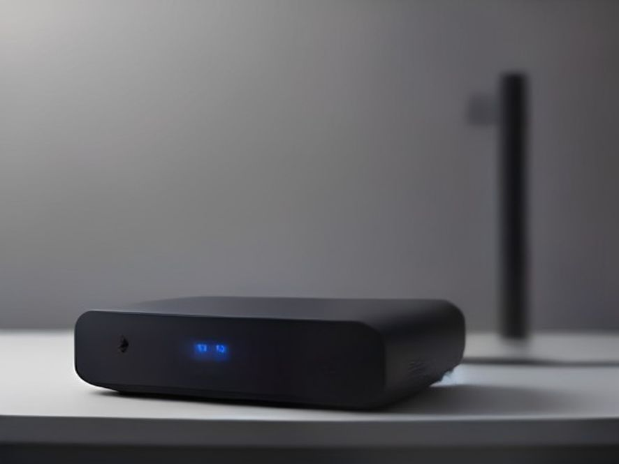

# ImageGen MCP


Free, keyless image generation for any MCP-enabled AI agent. Give your assistant the ability to create images from text prompts — with no API key, no billing, and no account setup.

## What it gives you

- **One MCP tool: `generate_image`** — text prompt in, local image file out. Also `health` for readiness checks.
- **Zero configuration** — no API keys, no accounts, no cost. The provider is Pollinations (Flux), a free community text-to-image service.
- **Five aspect ratios** — `1:1`, `3:4`, `4:3`, `9:16`, `16:9` (default `1:1`).
- **Local-first output** — images are saved to disk and returned as file paths; nothing is uploaded to a third party beyond the image request itself.
- **Defensive by design** — prompt length limits, output-dir writability checks, and structured `{ok, ...}` / `{ok: false, error}` responses for clean agent error handling.

## See it in action

Real outputs generated with this server (Pollinations / Flux, no API key, no post-processing):




Every image above was produced by a single `generate_image` call with just a text prompt and an aspect ratio.

## How it works

```
AI agent → MCP tool generate_image(prompt, aspect_ratio) → Pollinations API → local image file → path returned to agent
```

The server speaks the Model Context Protocol (stdio transport) and uses FastMCP, so it plugs into any MCP host — including Hermes, Claude Desktop, or custom agent frameworks.

## Installation

```bash
pip install -r requirements.txt   # installs mcp
python imagegen_mcp_server.py      # runs the MCP server over stdio
```

Or register it as a stdio MCP server in your host. Example (Hermes config):

```yaml
mcp_servers:
  imagegen:
    command: /path/to/python
    args:
      - /path/to/imagegen_mcp_server.py
    enabled: true
    trust: full
```

## Usage

Call the `generate_image` tool from your agent:

```
generate_image(prompt="a red sports car in a rainy city at night", aspect_ratio="16:9")
```

Returns on success:

```json
{
  "ok": true,
  "path": "/home/user/gemini-image-mcp/output/img_20260816_222542_42026.jpeg",
  "mime_type": "image/jpeg",
  "size_bytes": 53907,
  "aspect_ratio": "16:9",
  "provider": "pollinations",
  "message": "image saved to /home/user/gemini-image-mcp/output/img_20260816_222542_42026.jpeg"
}
```

### Options

| Argument | Default | Notes |
|---|---|---|
| `prompt` | — (required) | Text description, max 2000 chars |
| `aspect_ratio` | `1:1` | One of `1:1`, `3:4`, `4:3`, `9:16`, `16:9` |
| `output_dir` | env or `~/gemini-image-mcp/output` | Where the image is saved; override per-call or via `IMAGE_MCP_OUTPUT_DIR` |

## Notes & limitations

- Pollinations is a free community service — **no SLA**. Expect occasional slowness or brief downtime; fine for casual/prototyping use, not for a production dependency.
- The endpoint blocks default HTTP client user-agents (403), so the server sends a real browser `User-Agent` header.
- Each image is roughly 20–65 KB, so storage stays negligible.

## License

MIT — see [LICENSE](LICENSE).
